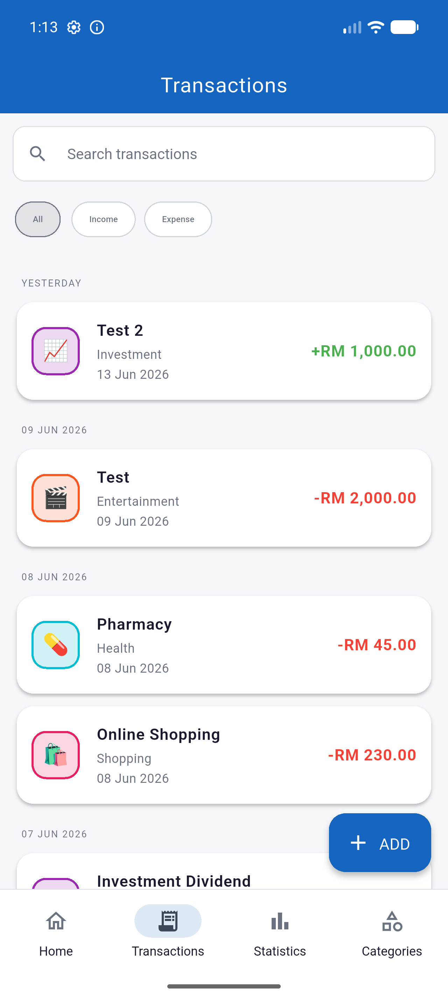
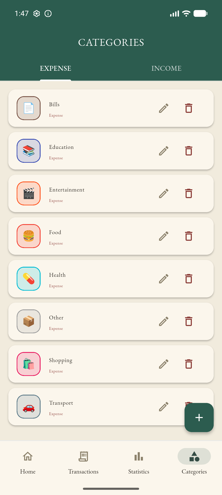

FinTrack — Personal Finance Tracker

Features

- **Dashboard** — total balance, a computed "% saved" indicator, income/expense
  summary, quick-add actions, and recent activity.
- **Full CRUD** — create, read, update, and delete both **transactions** and
  **categories**, with form validation.
- **Transactions** — searchable history grouped by date (Today / Yesterday /
  date), with income/expense filters and swipe-to-delete.
- **Statistics** — a custom-painted **donut chart** plus per-category spending
  bars and a transaction overview.
- **AI Insights** — a money "health score", a spending-trend line chart, and
  written tips. Powered by **Google Gemini** when an API key is set, with an
  automatic **rule-based fallback** so it always works even without a key.
- **Rewards & daily check-in** — earn XP with a daily check-in and spend it to
  unlock extra themes.
- **Categories** — manage income/expense categories with custom icons & colours.
- **Accounts** — email/password and Google sign-in via Firebase Auth.
- **Cloud persistence** — categories and transactions are stored in Firestore,
  reached through a dedicated backend (not directly from the client); nothing
  is lost on restart and data follows the user across devices.
- **4 switchable themes** — a custom theming engine offering **Original**
  (clean Material), **Gundam** and **Hello Kitty** (retro pixel), and
  **Luxury — "Old Money"** (elegant serif). One widget set renders every theme.

Screenshots

| Dashboard (Original) | Dashboard (Luxury) | Statistics |
|---|---|---|
|  |  |  |

| Transactions | Add Transaction | Categories |
|---|---|---|
|  |  |  |

Tech Stack

| Concern | Choice |
|---|---|
| Framework / language (client) | Flutter · Dart |
| Backend | FastAPI (Python) |
| State management | `provider` (`ChangeNotifier`) |
| Auth | Firebase Auth (email/password + Google), called directly from the client |
| Data persistence | Firestore — written only by the backend, via the Firebase Admin SDK |
| AI insights | Google Gemini (`gemini-2.5-flash`) with a rule-based fallback |
| Formatting | `intl` (currency & dates) |
| Theming | Custom `ThemeExtension` (`PixelColors`) + style-knobs |
| Charts / mascots | Hand-written `CustomPainter` (no chart dependency) |

Architecture

The repository is a monorepo with two parts, both active:

```
fintrack/
├── fintrack-mobile/   # Flutter app
└── fintrack-api/      # FastAPI backend
```

**Two separate connections, two separate trust models** (see
[current_structure.md](current_structure.md) for the full breakdown):

1. **Auth** — the Flutter app talks to Firebase Auth *directly*. Sign-in,
   sign-up, Google sign-in, and password reset never touch the backend.
2. **Data** — categories, transactions, insights, and rewards go through
   `fintrack-api`, which is the only thing that talks to Firestore. The client
   has no Firestore dependency at all; `firestore.rules` denies the client SDK
   entirely, so the API is the sole writer.

```
fintrack-mobile (Flutter)                 fintrack-api (FastAPI)              Firebase
─────────────────────────                 ──────────────────────              ────────
AuthService ─────────────────────────────────────────────────────────────▶ Firebase Auth
  (sign in/up, Google, reset)                                               (identity)

TransactionProvider
  → HttpRepository ───── Bearer <ID token> ─────▶ get_current_uid()
                          GET/POST/PUT/DELETE        verifies token, derives uid
                          /categories, /transactions  ↓
                          /insights, /rewards      Admin SDK ──────────────▶ Firestore
                                                    (bypasses firestore.rules    (data)
                                                     by design)
                                                       │
                                                       └── /insights ──▶ Google Gemini
                                                           (optional; rule-based fallback)
```

The Flutter app (`fintrack-mobile/`) follows a layered structure with clear
separation of concerns:

```
fintrack-mobile/lib/
├── main.dart                            # App entry: Firebase.initializeApp, providers, MaterialApp
├── firebase_options.dart                # Firebase project config (generated)
├── models/                              # Plain data models
│   ├── transaction.dart
│   └── category.dart
├── services/
│   ├── auth_service.dart                # All Firebase Auth calls (the only file that touches it)
│   ├── finance_repository.dart          # Storage-agnostic interface (Category/Transaction CRUD)
│   ├── http_repository.dart             # FinanceRepository impl - calls fintrack-api
│   ├── in_memory_repository.dart        # FinanceRepository impl - test double
│   ├── insights_api.dart                # Fetches AI insights from fintrack-api
│   ├── insights_service.dart            # Parses the insights response into models
│   ├── reward_repository.dart           # XP, daily check-in, unlockable themes
│   ├── api_config.dart                  # fintrack-api base URL (local-dev only)
│   └── default_categories.dart          # Starter categories seeded for new users
├── providers/                           # State management (ChangeNotifier)
│   ├── transaction_provider.dart        # transactions, categories, totals, aggregation
│   ├── auth_provider.dart               # auth UI state, forwards to AuthService
│   ├── check_in_provider.dart           # daily check-in, XP, theme unlocking
│   └── theme_provider.dart              # active theme
├── routes/
│   ├── app_router.dart                  # onGenerateRoute
│   └── app_routes.dart                  # route name constants
├── screens/                             # One file per screen
│   ├── home_screen.dart                 # dashboard + bottom navigation host
│   ├── transactions_screen.dart
│   ├── statistics_screen.dart
│   ├── ai_insights_screen.dart          # health score, trend chart, AI tips
│   ├── categories_screen.dart
│   ├── add_edit_transaction_screen.dart
│   └── auth/                            # auth_gate, login, signup, forgot_password
├── widgets/                             # Reusable UI components
│   ├── balance_card.dart
│   ├── transaction_tile.dart
│   ├── theme_switcher.dart
│   ├── auth_scaffold.dart
│   └── mascots.dart                     # CustomPainter theme mascots
├── utils/
│   └── currency_formatter.dart          # RM currency formatting helper
└── theme/
    └── app_theme.dart                   # PixelColors ThemeExtension + all themes
```

The backend (`fintrack-api/`) is a thin, conventionally-layered FastAPI app:

```
fintrack-api/app/
├── main.py                 # FastAPI() app, CORS (local-dev), router registration, /health
├── firebase_client.py      # Firebase Admin SDK init (service-account credentials)
├── auth.py                 # Verifies the Bearer ID token, derives uid for every request
├── schemas/                # Pydantic request/response models
│   ├── category.py
│   ├── transaction.py
│   ├── insights.py
│   └── reward.py
├── routers/                # HTTP layer only
│   ├── categories.py
│   ├── transactions.py
│   ├── insights.py         # GET /insights
│   └── rewards.py          # daily check-in + XP endpoints
└── services/               # Firestore reads/writes + business logic
    ├── category_service.py
    ├── transaction_service.py
    ├── insights_service.py # builds facts, calls Gemini, rule-based fallback
    └── reward_service.py
```

**Data flow:** UI (screens/widgets) → `Provider` (state) → `FinanceRepository`
(interface) → `HttpRepository` → `fintrack-api` → Firestore. Widgets read
theme tokens via `PixelColors.of(context)` and rebuild when the provider
notifies a change.

Theming engine

Themes are not just colour swaps. `app_theme.dart` exposes a `PixelColors`
`ThemeExtension` carrying both **role colours** (`income`, `expense`, `accent`,
`surface`, gradient, …) and **style knobs** (`radius`, `borderWidth`,
`hardShadow`, `fontFamily`). The same widgets therefore render:

- **Original** — soft, rounded, Material (Roboto)
- **Gundam / Hello Kitty** — square corners, hard offset shadows, pixel font
  (Press Start 2P)
- **Luxury** — soft rounded, antique-gold accents, elegant **serif** (EB Garamond)

Any new UI must read these tokens (never hard-code colours/fonts) so all themes
keep working.

Getting Started

Open the project folder in **VS Code**, then use its built-in terminal
(**Terminal → New Terminal**, or `` Ctrl+` ``) to run the commands below.
The app runs in **Google Chrome**.

Steps 1–2 are a one-time setup. After that, you only repeat steps 3–4 to launch
the app.

**1. Install the tools you need**

Download and install these (accept the default options), then restart VS Code:

- **Flutter SDK** — https://docs.flutter.dev/get-started/install (installs Dart too)
- **Python 3.12 or newer** — https://www.python.org/downloads/
  (on Windows, tick "Add python.exe to PATH" during install)
- **Google Chrome**

Recommended: install the **Flutter** and **Python** extensions in VS Code.

In a VS Code terminal, confirm both tools are found:

```
flutter --version
python --version
```

Both should print a version. If you see "not recognized"/"command not found",
the tool isn't on your PATH — reinstall it and restart VS Code.

First time only, enable Flutter's web support:

```
flutter config --enable-web
```

**2. Add the Firebase key** (one-time — needed for login & saving data)

The backend needs a Firebase service-account key. Without it the app still
opens, but you can't log in or save data.

1. In the Firebase Console, open your project → **Project settings** →
   **Service accounts** → **Generate new private key** (downloads a `.json`).
2. Move that file into the `fintrack-api` folder and name it
   **`serviceAccountKey.json`**.

**3. Start the backend** (first VS Code terminal — leave it running)

```
cd fintrack-api
copy .env.example .env
python -m venv .venv
.venv\Scripts\activate
pip install -r requirements.txt
uvicorn app.main:app --reload --port 8000
```

This terminal is now the server — **keep it open**. To check it worked, open
**http://localhost:8000/health** in a browser; it should report the server is up.

> Next time you only need: `.venv\Scripts\activate` then
> `uvicorn app.main:app --reload --port 8000`. The `copy`, `venv`, and
> `pip install` steps are first-time only.

**4. Start the app in Chrome** (open a SECOND terminal)

Click the **+** in the VS Code terminal panel to open another terminal (so the
backend keeps running in the first one), then:

```
cd fintrack-mobile
flutter pub get
flutter run -d chrome --web-port=5173
```

Chrome opens automatically with FinTrack running. The first run downloads
packages and can take a minute. (`flutter pub get` is first-time only.)

**5. Use the app**

Sign up (or use Google sign-in), then add a transaction — it should appear on
the dashboard and still be there after a refresh.

To **stop** everything: click into each terminal and press `q` (the app) /
`Ctrl + C` (the server), or just close the terminals.

> **Shortcut (Windows):** instead of steps 3–4, you can double-click
> `run-dev.bat` in the project folder to set up and launch both at once.

**(Optional) Enable real Gemini AI insights**

Insights work out of the box using a built-in rule-based fallback. To use the
real Gemini model instead:

1. Get a free key at **https://aistudio.google.com/apikey**.
2. Open `fintrack-api\.env` in a text editor and set
   `GEMINI_API_KEY=your-key-here`.
3. Stop the backend (`Ctrl + C`) and start it again.

Leaving the key blank keeps the rule-based insights — you still get a health
score, trend chart, and tips.

Quality

```bash
cd fintrack-mobile
flutter analyze lib   # static analysis of the app (currently: no issues)
flutter test          # unit / widget tests
```

Data model

| Entity | Key fields |
|---|---|
| **Transaction** | id, title, amount, date, type (income/expense), categoryId, note |
| **Category** | id, name, icon, colorValue, type (income/expense/both) |

Stored in Firestore (`users/{uid}/transactions`, `users/{uid}/categories`),
written only by `fintrack-api`, and aggregated client-side for balance,
totals, and per-category statistics.

References

- [Flutter](https://flutter.dev) & [Dart](https://dart.dev)
- [FastAPI](https://fastapi.tiangolo.com) & [Firebase Admin SDK](https://firebase.google.com/docs/admin/setup)
- [Google Gemini API](https://ai.google.dev/) (optional AI insights)
- Client packages: `provider`, `firebase_auth`, `firebase_core`, `http`, `intl`, `uuid`
- Backend packages: `fastapi`, `uvicorn`, `firebase-admin`, `pydantic`, `python-dotenv`
- Fonts: [Press Start 2P](https://fonts.google.com/specimen/Press+Start+2P) and
  [EB Garamond](https://fonts.google.com/specimen/EB+Garamond) (SIL OFL)
- UI design exploration assisted by **Google Stitch**; development assisted with
  AI tooling. (Disclosed per academic-honesty guidance.)
