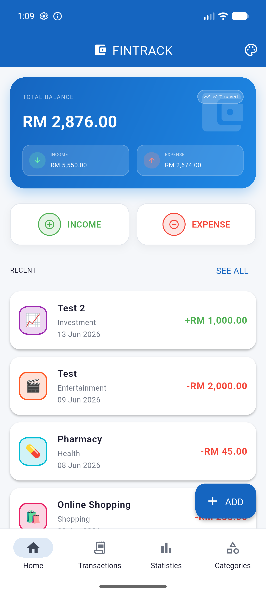
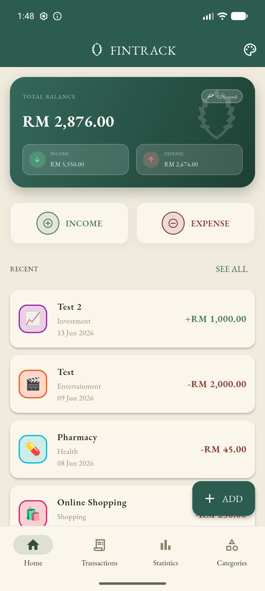
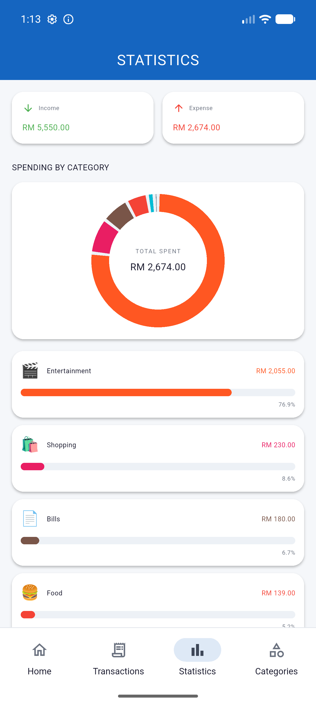
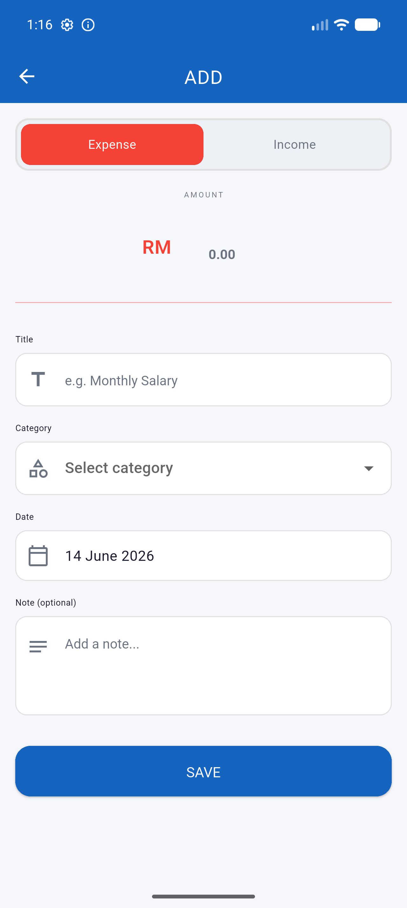

FinTrack — Personal Finance Tracker

A Flutter mobile application for tracking personal income and expenses in
Malaysian Ringgit (RM). Built for **CSC2074 Mobile Application Development**
(Sunway University), FinTrack lets users record transactions, organise them by
category, and understand their spending through visual insights — all stored
locally on the device so the data survives app restarts.

> **Problem it solves:** Many people lose track of where their money goes.
> FinTrack gives a fast, offline, at-a-glance view of balance, income, expenses,
> and spending breakdowns, with a frictionless flow for logging transactions.

---

## ✨ Features

- **Dashboard** — total balance, a computed "% saved" indicator, income/expense
  summary, quick-add actions, and recent activity.
- **Full CRUD** — create, read, update, and delete both **transactions** and
  **categories**, with form validation.
- **Transactions** — searchable history grouped by date (Today / Yesterday /
  date), with income/expense filters and swipe-to-delete.
- **Statistics** — a custom-painted **donut chart** plus per-category spending
  bars and a transaction overview.
- **Categories** — manage income/expense categories with custom icons & colours.
- **Local persistence** — all data stored in **SQLite**; nothing is lost on
  restart.
- **5… now 4 switchable themes** — a custom theming engine offering **Original**
  (clean Material), **Gundam** and **Hello Kitty** (retro pixel), and
  **Luxury — "Old Money"** (elegant serif). One widget set renders every theme.

## 📱 Screenshots

| Dashboard (Original) | Dashboard (Luxury) | Statistics |
|---|---|---|
|  |  |  |

| Transactions | Add Transaction | Categories |
|---|---|---|
|  |  |  |

🛠 Tech Stack

| Concern | Choice |
|---|---|
| Framework / language | Flutter · Dart |
| State management | `provider` (`ChangeNotifier`) |
| Local persistence | `sqflite` (SQLite) |
| Formatting | `intl` (currency & dates) |
| Theming | Custom `ThemeExtension` (`PixelColors`) + style-knobs |
| Charts / mascots | Hand-written `CustomPainter` (no chart dependency) |

## 🏗 Architecture

FinTrack follows a layered structure with clear separation of concerns:

```
lib/
├── main.dart                       # App entry, providers, MaterialApp
├── models/                         # Plain data models
│   ├── transaction.dart
│   └── category.dart
├── services/
│   └── database_service.dart       # SQLite CRUD singleton (data layer)
├── providers/                      # State management (ChangeNotifier)
│   ├── transaction_provider.dart   # transactions, categories, summaries
│   └── theme_provider.dart         # active theme
├── screens/                        # One file per screen
│   ├── home_screen.dart            # dashboard + bottom navigation host
│   ├── transactions_screen.dart
│   ├── statistics_screen.dart
│   ├── categories_screen.dart
│   └── add_edit_transaction_screen.dart
├── widgets/                        # Reusable UI components
│   ├── balance_card.dart
│   ├── transaction_tile.dart
│   ├── theme_switcher.dart
│   └── mascots.dart                # CustomPainter theme mascots
└── theme/
    └── app_theme.dart              # PixelColors ThemeExtension + all themes
```

**Data flow:** UI (screens/widgets) → `Provider` (state) → `DatabaseService`
(SQLite). Widgets read theme tokens via `PixelColors.of(context)` and rebuild
when the provider notifies a change.

🎨 Theming engine

Themes are not just colour swaps. `app_theme.dart` exposes a `PixelColors`
`ThemeExtension` carrying both **role colours** (`income`, `expense`, `accent`,
`surface`, gradient, …) and **style knobs** (`radius`, `borderWidth`,
`hardShadow`, `fontFamily`). The same widgets therefore render:

- **Original** — soft, rounded, Material (Roboto)
- **Gundam / Hello Kitty** — square corners, hard offset shadows, pixel font
  (Press Start 2P)
- **Luxury** — soft rounded, antique-gold accents, elegant **serif** (EB Garamond)

Any new UI must read these tokens (never hard-code colours/fonts) so all themes
keep working.

## 🚀 Getting Started

### Prerequisites
- [Flutter SDK](https://docs.flutter.dev/get-started/install) (Dart SDK `^3.12`)
- Android Studio / Xcode, or an Android emulator / physical device

### Run
```bash
# 1. Clone
git clone https://github.com/evantjk/fintrack.git
cd fintrack

# 2. Install dependencies
flutter pub get

# 3. Launch a device/emulator, then run
flutter run
```

Build a release APK
```bash
flutter build apk --release
```

## ✅ Quality

```bash
flutter analyze   # static analysis (currently: no issues)
flutter test      # unit / widget tests
```

## 📁 Data model

| Entity | Key fields |
|---|---|
| **Transaction** | id, title, amount, date, type (income/expense), categoryId, note |
| **Category** | id, name, icon, colorValue, type (income/expense) |

Stored in a local SQLite database (`fintrack.db`) and aggregated on the fly for
balance, totals, and per-category statistics.

## 🙏 Acknowledgements & References

- [Flutter](https://flutter.dev) & [Dart](https://dart.dev)
- Packages: `provider`, `sqflite`, `intl`, `path`, `uuid`
- Fonts: [Press Start 2P](https://fonts.google.com/specimen/Press+Start+2P) and
  [EB Garamond](https://fonts.google.com/specimen/EB+Garamond) (SIL OFL)
- UI design exploration assisted by **Google Stitch**; development assisted with
  AI tooling. (Disclosed per academic-honesty guidance.)
